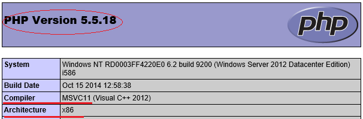

While working with websites on Azure, sometimes you may need to install additional extensions. It is important to find the right extension that matches the PHP running on Azure website. PHP function "phpinfo()" collects PHP version and runtime environment information, you can call the function in code (<?php phpinfo();  ?>), (to quickly get the same information, you can run "php -I" from command line), for example,

PHP version is 5.5.18 in this example. Since extension .dll files could be compiled by different C++ compiler, the compiler version should be matching, in this example, it is **MS VC11**. The last one is Architecture information, in this example it is **x86**.

Further more, you can find PHP (and Zend) extension build is NTS (Non-Thread Safe).

From [http://windows.php.net/downloads/releases/archives/](http://windows.php.net/downloads/releases/archives/), find the matching PHP version in **nts** (Non-Thread Safe ), download and decompress the  .zip file, core extensions are listed in /ext, get the one you need from there.

In the case the functionality you need is not available in core extensions, you will find and download the extension from PECL (PHP Extension Community Library), versions should be matched in the same way.

For more details about how to add customer PHP extensions on Azure web site, refer to these documents: [http://azure.microsoft.com/en-us/documentation/articles/web-sites-php-configure/](http://azure.microsoft.com/en-us/documentation/articles/web-sites-php-configure/)

[http://blogs.msdn.com/b/silverlining/archive/2012/09/17/using-custom-php-extensions-in-windows-azure-web-sites.aspx](http://blogs.msdn.com/b/silverlining/archive/2012/09/17/using-custom-php-extensions-in-windows-azure-web-sites.aspx)